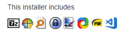
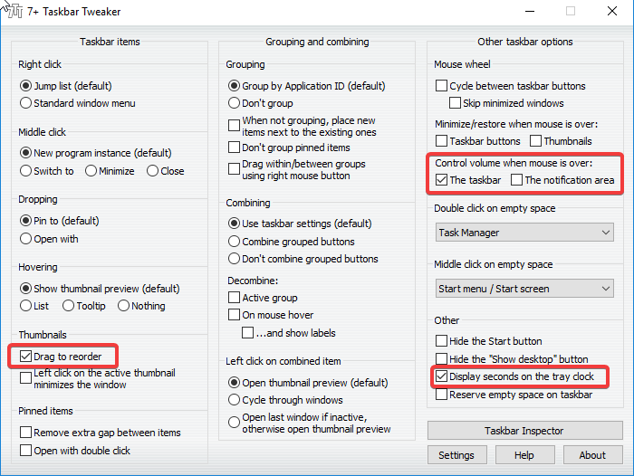
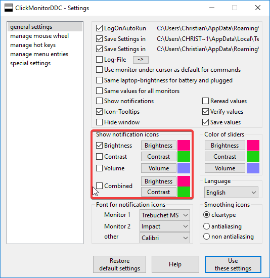
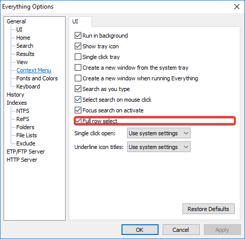
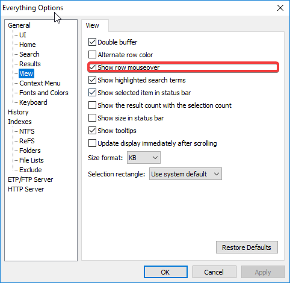
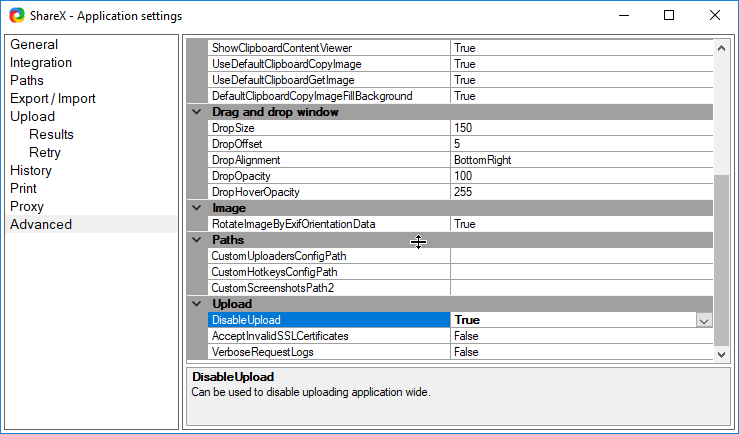
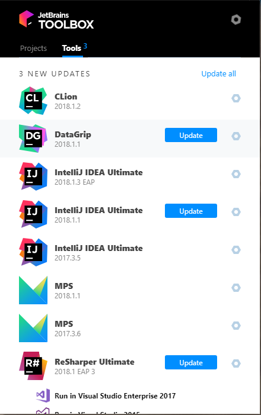

# dotfiles-windows

Manual Installation:
- [7+ Taskbar Tweaker](http://rammichael.com/7-taskbar-tweaker) Re-arrange window thumbnails in taskbar and other tweaks.
- [ClickMonitorDDC](http://clickmonitorddc.bplaced.net/)  Control monitor brightness via mouse wheel.
- [TotalCommander](https://www.ghisler.com/download.htm) Dual-pane file manager.
- [Jetbrains Toolbox](https://www.jetbrains.com/toolbox/app/) Manage Jetbrains IDEs.

Via Ninite:



[Download](https://ninite.com/7zip-classicstart-everything-keepass2-paint.net-sharex-sumatrapdf-vscode/)
[Change apps](https://ninite.com/?select=7zip-classicstart-everything-keepass2-paint.net-sharex-sumatrapdf-vscode)

- [7zip](https://www.7-zip.org/) Supports ZIP, RAR and many other archival formats.
- [ClassicShell](http://www.classicshell.net/) Start menu replacement
- [Everything](https://www.voidtools.com/downloads/)
  To find files quickly
- [KeePass 2](https://keepass.info/download.html) Offline password manager.
- Paint.NET
- [ShareX](https://getsharex.com/) Screenshot utility.
- [SumatraPDF](https://www.sumatrapdfreader.org/free-pdf-reader.html) Fast PDF viewer with auto-refresh and without file locking.
- [Visual Studio Code](https://code.visualstudio.com/) Modern code editor.


## Systray

Startmenu: "Select which icons appear on the taskbar"
- Greenshot
- ShareX
- Toolbox

## Customization
### 7+ Taskbar Tweaker

- Drag to reorder: Reorder Taskbar preview images with drag'n'drop to make switching between applications with WIN-NUMBER shortcuts easier.
- Control volume when mouse is over taskbar
- Display seconds on the tray clock



### ClickMonitorDDC

#### Disable constrast and volume systray icons

- Open the settings via rightclick in the systray on one of the number icons.
- Disable the volume and contrast systray icons




### Everything

- General -> UI: Full row select (easier to match up date/size with selected item)
- General -> View: Show row mouseover




### ShareX

##### Disable screenshot sound

#### Disable uploads globally

Application Settings -> Advanced -> Upload: DisableUpload: True




Screenshots:

Jetbrains Toolbox:




---

### Total Commander

Redirect wincmd.ini File: Change the registry key `IniFileName` to point to the `wincmd.ini` file from this repository.


```powershell
# Set 
Get-ItemPropertyValue 'HKCU:\Software\Ghisler\Total Commander\' IniFileName
Set-ItemProperty -Path 'HKCU:\Software\Ghisler\Total Commander\' -Name 'IniFileName' -Value 'INSERT_PATH_TO_DOTFILES\totalcmd\wincmd.ini'
```


## VSCode

VS Code extensions

```
code --install-extension alefragnani.project-manager
code --install-extension bungcip.better-toml
code --install-extension Connorcpu.vsc-rustfmt
code --install-extension dbaeumer.vscode-eslint
code --install-extension dollyn.line-counter
code --install-extension donjayamanne.githistory
code --install-extension donjayamanne.python
code --install-extension EditorConfig.EditorConfig
code --install-extension eg2.tslint
code --install-extension eliean.vscode-svn
code --install-extension fantasytyx.tortoise-svn
code --install-extension formulahendry.code-runner
code --install-extension kalitaalexey.vscode-rust
code --install-extension ms-vscode.PowerShell
code --install-extension msjsdiag.debugger-for-chrome
code --install-extension mushan.vscode-paste-image
code --install-extension PeterJausovec.vscode-docker
code --install-extension redhat.java
code --install-extension robertohuertasm.vscode-icons
code --install-extension slevesque.vscode-autohotkey
code --install-extension vadimcn.vscode-lldb
code --install-extension xabikos.JavaScriptSnippets
code --install-extension zhuangtongfa.Material-theme
```